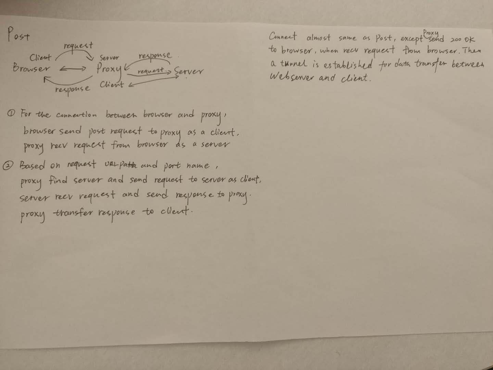
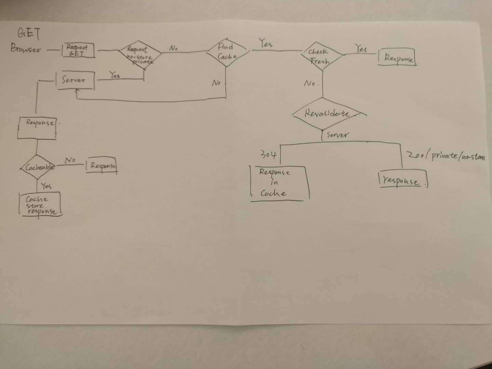

# HTTP Caching Proxy (HW2 for ECE 568 ERSS 2020 Spring)

By Qing Lu, Chixiang Zhang

This is a HTTP proxy that can handle GET (with cache), POST and CONNECT. Also, it can implemented multi-thread to handle with concurrency.

Please refer to the version with the latest ```finalize``` commit for grading.

To run our program, type ```sudo docker-compose up``` on the terminal. Wait a few seconds for the program to be fully compiled.

While the program is running, you can open ```./proxy/proxy.log``` to monitor HTTP request/response, which is also attached in ```/var/log/erss/``` in the docker image. Test cases with tip can be found in ```./test.txt```.

Tips while testing:

- Some website may take lot of time to load. Please refresh the website if the browser cannot successfully load the page (e.g. connection refused, time out). If that still does not work, please terminate the program by Control-C and re-run the program.

- It is possible for our program to be terminated when a exception throwing. If that happens please re-run the program.

If ```sudo docker-compose up``` does not work, please do the following on the terminal to run our program:

```
cd proxy
make clean
make
./hwk2_proxy
```

If you want to see GET, POST and CONNECT, as well as our cache policy, you could refer to two images:





If you have any questions, please contact us!